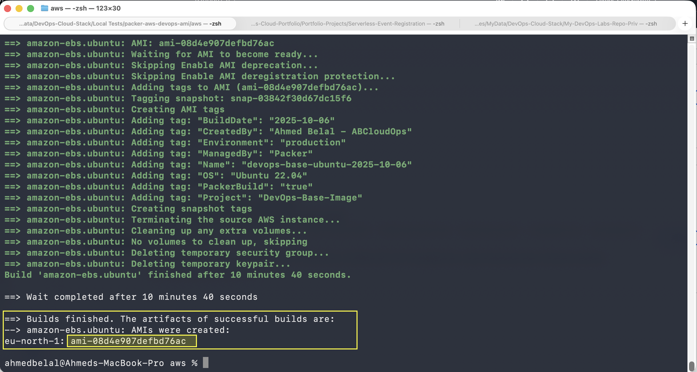
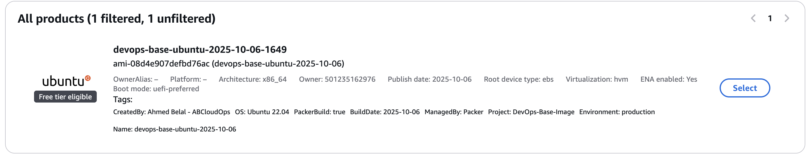

# Packer AWS DevOps Base AMI

**GitHub Repository:** [https://github.com/engabelal/packer-aws-devops-ami](https://github.com/engabelal/packer-aws-devops-ami)

Golden AMI with essential DevOps tools for AWS EC2 instances.

## 🎯 What's Included

- **Ubuntu 22.04 LTS** - Base operating system
- **Git** - Version control
- **AWS CLI v2** - AWS command line interface
- **CloudWatch Agent** - Metrics and logs collection
- **SSM Agent** - Remote management
- **Core Tools** - curl, wget, vim, nano, unzip, tar, htop, tree, jq
- **Security** - UFW firewall, Fail2ban, SSH hardening
- **Auto Updates** - Unattended security updates

## 📸 Build Results

### Packer Build Output


*Successful Packer build showing all provisioning steps completed*

### Created AMI


*The resulting AMI visible in AWS EC2 Console*


## 📁 Project Structure

```
.
├── aws/
│   ├── ubuntu-devops-base.pkr.hcl       # Main Packer template
│   ├── variables.pkr.hcl                # Variables definition
│   └── terraform.auto.pkrvars.hcl       # Variable values
├── scripts/
│   ├── 01-update-system.sh              # System updates
│   ├── 02-install-tools.sh              # Core tools
│   ├── 03-install-aws-cli.sh            # AWS CLI v2
│   ├── 04-install-cloudwatch-agent.sh   # CloudWatch Agent
│   ├── 05-install-ssm-agent.sh          # SSM Agent
│   ├── 06-security-hardening.sh         # Security configuration
│   ├── 07-configure-auto-updates.sh     # Automatic updates
│   └── 08-cleanup.sh                    # Cleanup
├── configs/
│   ├── sshd_config                      # Hardened SSH config
│   └── cloudwatch-config.json           # CloudWatch config
├── images/
│   ├── terminal_result.png              # Build output screenshot
│   └── Template_result.png              # AMI result screenshot
├── .gitignore
├── README.md
```
## 🚀 Prerequisites

- Packer >= 1.9.0
- AWS CLI configured with credentials
- IAM permissions to create EC2 instances and AMIs
- SSH key pair for Packer (optional, but recommended for troubleshooting)

### Create SSH Key Pair (Optional)

Packer can use temporary keys, but you can create a persistent key:

```bash
# Create key pair and save to file
aws ec2 create-key-pair \
  --key-name my-packer-key \
  --query 'KeyMaterial' \
  --output text > my-packer-key.pem

# Set correct permissions
chmod 400 my-packer-key.pem
```

### Find AMI Owner ID

**If you don't know the AMI owner ID, use these commands:**

```bash
# Method 1: Search by AMI name pattern (Ubuntu example)
aws ec2 describe-images \
  --filters "Name=name,Values=ubuntu/images/hvm-ssd/ubuntu-jammy-22.04-amd64-server-*" \
  --query 'Images | sort_by(@, &CreationDate) | [-1].[ImageId,Name,OwnerId,CreationDate]' \
  --output table

# Method 2: Search for specific AMI by ID
aws ec2 describe-images \
  --image-ids ami-xxxxxxxxx \
  --query 'Images[0].[ImageId,Name,OwnerId]' \
  --output table

# Method 3: List all public Ubuntu images (shows owner)
aws ec2 describe-images \
  --owners 099720109477 \
  --filters "Name=name,Values=ubuntu/images/*22.04*" \
  --query 'Images[*].[ImageId,Name,OwnerId]' \
  --output table | head -20
```

**Common AMI Owner IDs:**
- `099720109477` = Canonical (Ubuntu official)
- `137112412989` = Amazon Linux
- `309956199498` = Red Hat (RHEL)
- `125523088429` = CentOS
- `013907871322` = SUSE

## 📝 How to Build AMI

### Step 1: Navigate to Project Directory

```bash
cd "/path/to/packer-aws-devops-ami/aws"
```

### Step 2: Initialize Packer

Download required plugins:

```bash
packer init .
```

**Output:**
```
Installed plugin github.com/hashicorp/amazon v1.2.8
```

### Step 3: Format Code (Optional)

```bash
packer fmt .
```

### Step 4: Validate Template

Check for syntax errors:

```bash
packer validate .
```

**Output:**
```
The configuration is valid.
```

### Step 5: Build AMI

**Basic build:**
```bash
packer build .
```

**Build with custom variables:**
```bash
packer build -var="aws_region=us-east-1" .
```

**Build with multiple variables:**
```bash
packer build \
  -var="aws_region=us-east-1" \
  -var="instance_type=t3.small" \
  .
```

**Debug mode (for troubleshooting):**
```bash
packer build -debug .
```

**Verbose logging:**
```bash
PACKER_LOG=1 packer build .
```

### What Happens During Build?

1. ✅ **Launch EC2 Instance** - Packer launches temporary t3.micro instance
2. ✅ **Wait for SSH** - Connects to instance via SSH
3. ✅ **Wait for Cloud-Init** - Ensures system is ready
4. ✅ **Copy Config Files** - Transfers configuration files to /tmp
5. ✅ **Run Provisioning Scripts** - Executes all 8 scripts in order:
   - Update system packages
   - Install core tools (git, curl, vim, etc.)
   - Install AWS CLI v2
   - Install CloudWatch Agent
   - Update SSM Agent
   - Security hardening (UFW, Fail2ban, SSH)
   - Configure automatic updates
   - Cleanup temporary files
6. ✅ **Create AMI Snapshot** - Creates AMI from the instance
7. ✅ **Terminate Instance** - Deletes temporary EC2 instance
8. ✅ **Output AMI ID** - Displays the new AMI ID

**Expected Output:**
```
amazon-ebs.ubuntu: output will be in this color.

==> amazon-ebs.ubuntu: Prevalidating any provided VPC information
==> amazon-ebs.ubuntu: Prevalidating AMI Name: devops-base-ubuntu-2025-01-15-1430
==> amazon-ebs.ubuntu: Creating temporary keypair: packer_xxxxx
==> amazon-ebs.ubuntu: Creating temporary security group for this instance...
==> amazon-ebs.ubuntu: Launching a source AWS instance...
==> amazon-ebs.ubuntu: Waiting for instance to become ready...
==> amazon-ebs.ubuntu: Using SSH communicator to connect: 13.xx.xx.xx
==> amazon-ebs.ubuntu: Waiting for SSH to become available...
==> amazon-ebs.ubuntu: Connected to SSH!
==> amazon-ebs.ubuntu: Provisioning with shell script: ../scripts/01-update-system.sh
...
==> amazon-ebs.ubuntu: Stopping the source instance...
==> amazon-ebs.ubuntu: Creating AMI devops-base-ubuntu-2025-01-15-1430 from instance i-xxxxx
==> amazon-ebs.ubuntu: AMI: ami-0123456789abcdef0
==> amazon-ebs.ubuntu: Terminating the source AWS instance...
Build 'amazon-ebs.ubuntu' finished after 6 minutes 32 seconds.

==> Wait completed after 6 minutes 32 seconds

==> Builds finished. The artifacts of successful builds are:
--> amazon-ebs.ubuntu: AMIs were created:
eu-north-1: ami-0123456789abcdef0
```

### Step 6: Verify AMI Created

```bash
# List your AMIs
aws ec2 describe-images \
  --owners self \
  --query 'Images[*].[ImageId,Name,CreationDate,State]' \
  --output table

# Get specific AMI details
aws ec2 describe-images \
  --image-ids ami-0123456789abcdef0 \
  --output json
```

### Step 7: Launch Instance from AMI

```bash
# Launch EC2 instance using your new AMI
aws ec2 run-instances \
  --image-id ami-0123456789abcdef0 \
  --instance-type t3.micro \
  --key-name your-key-pair \
  --security-group-ids sg-xxxxxx \
  --subnet-id subnet-xxxxxx \
  --tag-specifications 'ResourceType=instance,Tags=[{Key=Name,Value=DevOps-Test}]'
```

## ⚙️ Configuration

Edit `aws/terraform.auto.pkrvars.hcl`:

```hcl
aws_region      = "eu-north-1"
instance_type   = "t3.micro"
ami_name_prefix = "devops-base-ubuntu"

# Source AMI Owner (099720109477 = Canonical/Ubuntu official)
source_ami_owner = "099720109477"

# Optional: Use your own SSH key pair
ssh_keypair_name     = ""  # Leave empty for Packer temporary keys
ssh_private_key_file = ""  # Example: "./my-packer-key.pem"

tags = {
  Environment = "production"
  ManagedBy   = "Packer"
  Project     = "DevOps-Base-Image"
  CreatedBy   = "YourName"
}
```

## 🔧 Variables

| Variable | Description | Default |
|----------|-------------|---------|
| `aws_region` | AWS region to build AMI | eu-north-1 |
| `instance_type` | EC2 instance type | t3.micro |
| `ami_name_prefix` | AMI name prefix | devops-base-ubuntu |
| `source_ami_owner` | AMI owner account ID | 099720109477 (Canonical) |
| `ssh_username` | SSH username | ubuntu |
| `ssh_keypair_name` | SSH key pair name (optional) | "" (Packer creates temp keys) |
| `ssh_private_key_file` | Path to SSH private key (optional) | "" |
| `tags` | Tags to apply to AMI | See variables.pkr.hcl |

## 🧪 Testing

After building, launch an EC2 instance from the AMI and verify:

```bash
# SSH into instance
ssh -i your-key.pem ubuntu@<instance-ip>

# Verify installations
git --version
aws --version
vim --version

# Check CloudWatch agent
sudo /opt/aws/amazon-cloudwatch-agent/bin/amazon-cloudwatch-agent-ctl -a query

# Check SSM agent
sudo systemctl status snap.amazon-ssm-agent.amazon-ssm-agent.service

# Check firewall
sudo ufw status

# Check fail2ban
sudo fail2ban-client status
```

## 📊 Build Specifications

- **Build Time:** ~5-7 minutes
- **Image Size:** ~1.5 GB
- **Cost per Build:** ~$0.01 (t3.micro for 7 min)

## 🔒 Security Features

✅ SSH key-only authentication
✅ Root login disabled
✅ UFW firewall configured
✅ Fail2ban protection
✅ Automatic security updates
✅ Secure file permissions

## 🛠️ Customization

### Add More Tools

Edit `scripts/02-install-tools.sh`:

```bash
sudo apt-get install -y \
    your-tool-here
```

### Modify Security Settings

Edit `configs/sshd_config` or `scripts/06-security-hardening.sh`

### Change CloudWatch Metrics

Edit `configs/cloudwatch-config.json`

## 📝 Notes

- **SSH Key:** Packer uses temporary keys by default. The key pair creation is optional for manual testing
- **AMI Owner:** `099720109477` is Canonical's official AWS account for Ubuntu images
- **SSM Agent:** Pre-installed on Ubuntu AMIs, script only updates it
- **CloudWatch Agent:** Requires IAM role with CloudWatch permissions when running instances
- **UFW:** Allows only SSH (port 22) by default
- **Auto Updates:** Install security patches only, no automatic reboots

## 🧹 Cleanup

Packer automatically cleans up temporary resources. To delete the AMI:

```bash
aws ec2 deregister-image --image-id <ami-id> --region <region>
```

## 🤝 Contributing

Feel free to submit issues or pull requests for improvements.

## 📄 License

MIT License

## 👤 Author

**Ahmed Belal - ABCloudOps**
DevOps & Cloud Engineering

---

**Built with:** Packer | AWS | Ubuntu | Bash
